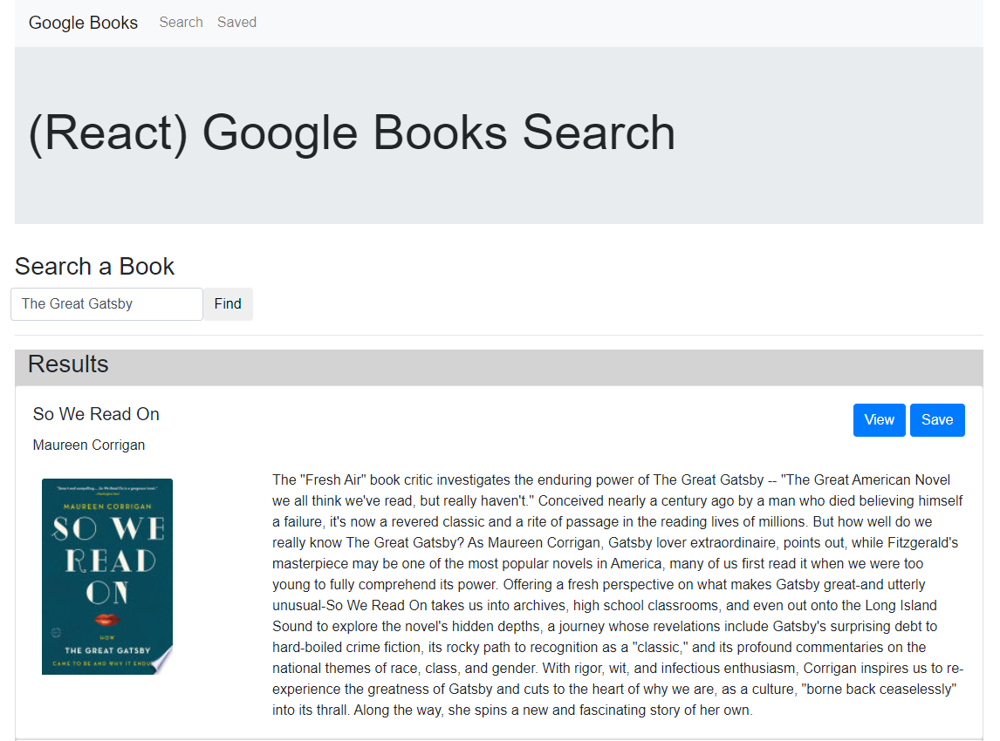
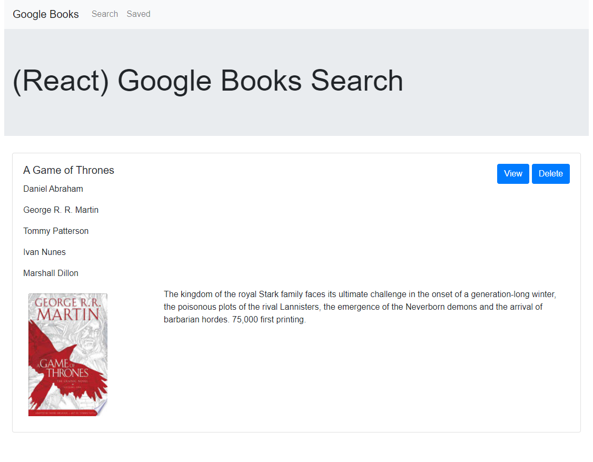

# Google Books Search (React) 

## Description

This app uses the google books api to find books and if desired, save them. It also allows users to view the google play page linked to the book. MongoDB is used to store saved books, Express is used for the backend server and routes, React is used for the frontend pages and interface, and numerous node libraries and scripts are used. This is a full MERN stack application.

## Images:

## Built With:

- MongoDB
- Express
- React
- Node
- Hosted on heroku

## Resource preferences:

- [Npm packages](https://www.npmjs.com/)

## Contributors:

- [James Totah ](https://github.com/jtwob)

## Links

- [Live App](https://google-books-jtwob.herokuapp.com/)
- [Github Repo](https://github.com/jtwob/google-books-search)
